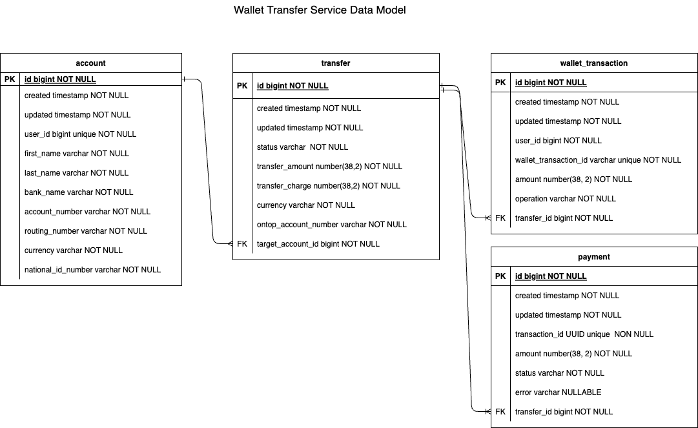
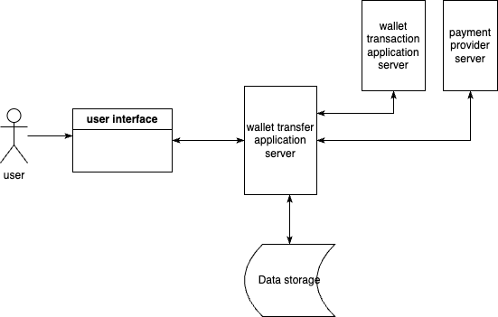

# Solution Design

## Context
This is the system design solution for the [ontop challenge](ontop-challenge.pdf)

## Identified user use cases
- Add bank Details
- Transfer money from wallet to bank account
- View transaction history with filter and sort capabilities

## Identified System Constraints
- system only supports USD transactions
- user can add bank details only once
  >we want the user to enter their bank details only once


## Design
### Data model


Three models were designed for this solution; account, transfer and wallet_transaction\
The account model is for persisting the user account details which is used for transfers\
The transfer model holds information about the state of the transfer operations(wallet transactions, payment) and the details of the transfer \
The wallet_transactions model persists information about wallet transaction operations(withdrawal, refund)
>ℹ️ The bank name field in the account table is not implemented in the code due to oversight. Couldn't fix it as well because of time constraint

<br/>

## User use cases flow
### Add Bank Details Flow

```bash
# add bank details api
POST: /ontop/accounts

request body: {
  userId, firstName, lastName, routingNumber, nationalId, accountNumber, bankName, currency?
}
response body: {
  userId, accountId, firstName, lastName, routingNumber, nationalId, accountNumber, bankName, currency?
}
```

### Money Transfer Flow


The money transfer request results in two operations, the wallet transaction and the payment. 
The wallet transaction could either be a withdrawal by which a transfer is initiated or a refund by which a transfer is reversed if payment fails. 
Each operation is handled asynchronously to enable robust performance and rich user experience.\
The client making the transfer request only gets a success response if the withdrawal operation is successful otherwise an error response with error message and code, 
the system continues to process the payment operation in the background. The transfer is reversed if the payment operation fails.\
Before each operation the server obtains a lock on the resource on which the operation is performed, this is to ensure atomicity and reliability of each operation.
The state of the transfer process is indicated by the status field in the transfer model 
- INITIALISED - This is the first state of the transfer, it indicates that the withdrawal operation was successful and the transfer has been initialised. 
- PROCESSING - The transfer status is in this state if the payment operation is successful
- FAILED - This is the status of the transfer when payment operation fails or payment confirmation fails
- REVERTED - This indicates that the transfer has been successfully reversed with a refund operation
- SUCCESSFUL - This is the status of transfer once we confirm that the payment to the target account is successful
- UNKNOWN - This indicates that the transfer state needs to be resolved
>ℹ️ The third party payment api always returns PROCESSING for successful payment operations and the solution to confirm payment 
> from third party is outside the scope of this challenge

#### Code navigation
- The `TransferInitialisationService` handles the client transfer request and starts the withdrawal operation, if the withdrawal is successful, it returns a response and publishes an event that indicates a successful withdrawal.
- The `TransferProcessingService` handles the successful withdrawal event and processes the payment. If the payment processing fails it publishes an event indicating the payment failed.
- The `TransferRevertService` handles the event of payment failure and reverses the withdrawal.

```bash
# money transfer api
POST: /ontop/transfers

request body: { userId, amount }
response body: { transactionId, userId, amount, created, operation, status }
```

### Transaction History Flow
```bash
# transaction history api
GET: /ontop/transfers

request params: userId, page, size, amount?, startDate?, endDate? # the fields marked with question mark are optional others are required
response body: [{ transactionId, userId, amount, created, operation, status }] # sorted descending by creation date
```
The transaction history is fetched from the wallet transaction table. 
The associated transfer status field in the transfer table determines the status of the transaction

## Architectural Diagram



## Solution improvement
- design retry mechanism when call to payment api times out
